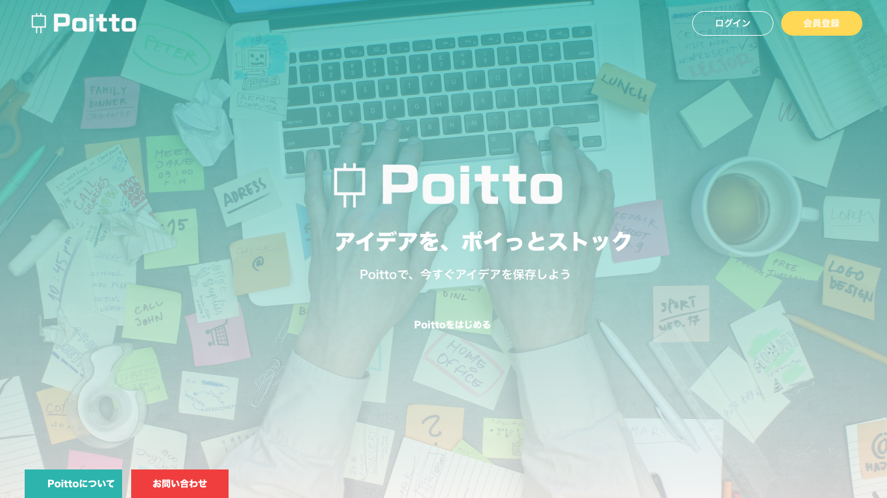

# 【学生限定】Spring Hackathon
https://ueqareer.connpass.com/event/120304/

最優秀賞と企業賞を受賞🎉

# 制作物
## Poitto
ブレーンストーミングや高機能なメモ帳と使用でき、簡単に「ぽいっと」アイディアを保存や共有ができるアプリです。

# 技術面
- フロントをReactで実装
- サーバーサイドはFirebase Realtime Databaseを使用

# 今回のアプリに貢献したところ
- Reactのコーディング
- Firebaseの接続

# やってみての感想・今後の課題
- Reactの環境を作るときにwebpackを後から追加しようとして失敗したので、はじめからしっかりと環境を作ってから始めるよにする。。
- 当初はwebsocket用のサーバーを用意しようとしていたがFirebase Realtime Databaseを使うことでwebsocket用のサーバーを用意する必要がなくなりサーバレスになった。Firebaseの認証周りもとても使いやすそうなので今後作るアプリで試してみる
- スマホのブラウザでフリック操作をする必要がありjavascriptでフリック操作ができずに、画面をクリックしてから離す時間を使ってスワイプ操作を取得していたが挙動が安定しないので、フリック操作を使うときはそもそもスマホアプリで作ることを考慮する
